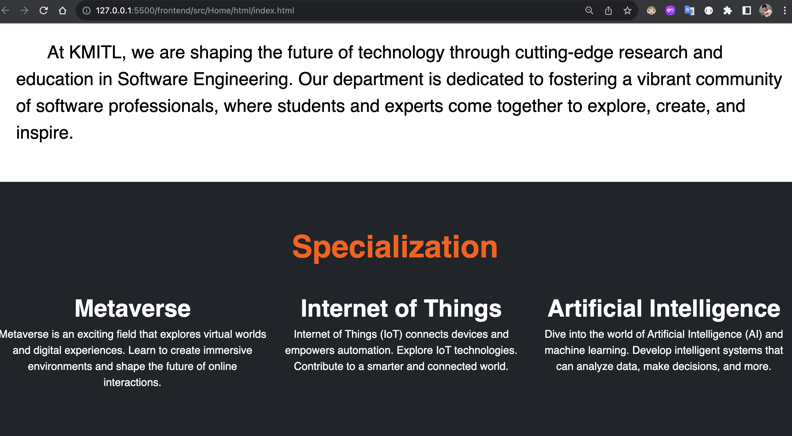

# Web Programming Semester Project
## Project Description

SE_website is our ambitious web programming semester project. We aim to create an innovative and dynamic web application that showcases our skills in web development. This project is a collaborative effort by the following team members:

1. **Soe Moe Htet-Stephen (ID: 65011693)**
2. **Jirapat Ruetrakul (ID: 65011313)**

If you want to see the details in pdf, here is [pdf file](/SoeMoeHtet_Prem_Project_Report.pdf)

# Project Title
BlogForgeKMITL (Blog-Editor)

## What is BlogForgeKMITL
A powerful and intuitive web and blog editor tailored for the King Mongkut's Institute of Technology Ladkrabang (KMITL) community. With redesigning the whole KMITL SE program website, Empowering users with a seamless writing and publishing experience, this platform combines cutting-edge technology with user-friendly features to streamline the creation and management of captivating blogs and website content.

## Table of Contents
- [Introduction](#introduction)
- [Key-Features](#key-features)
- [Web-Pages](#web-pages)
- [API](#api)

## Introduction
Provide step-by-step instructions on how to install your project. Include any dependencies that need to be installed.

# BlogForgeKMITL - Key Features

BlogForgeKMITL is a robust web and blog editor specifically tailored for the King Mongkut's Institute of Technology Ladkrabang (KMITL) community. The platform comes equipped with a range of features to enhance the blogging and website creation experience.

## Key Features:

1. **Effortless Editing:**
   - Craft compelling blog posts and web content with an intuitive and feature-rich editor.
   - Enjoy a user-friendly interface that simplifies the writing and editing process.

2. **KMITL Integration:**
   - Seamlessly integrates with KMITL's website, providing a dedicated space for the university community.
   - Ensure a cohesive online presence for KMITL with a unified and integrated blogging platform.

3. **Collaborative Publishing:**
   - Foster collaboration among contributors by allowing multiple users to work on content simultaneously.
   - Streamline the editorial workflow with built-in collaboration features.

4. **Responsive Design:**
   - Ensure a consistent and visually appealing experience across various devices.
   - Responsive and adaptive design for optimal viewing on desktops, tablets, and smartphones.

5. **Customization:**
   - Tailor the appearance of your blog or website to match the unique identity of KMITL.
   - Choose from customizable themes and layouts to create a distinctive online presence.

6. **Multimedia Support:**
   - Enhance storytelling with support for various multimedia elements.
   - Easily embed images, videos, and other multimedia content to enrich blog posts.

7. **Community Engagement:**
   - Encourage discussions and interactions among the KMITL community.
   - Built-in commenting system and social media integration for increased engagement.

BlogForgeKMITL is designed not only as a tool for content creation but as a comprehensive platform to showcase the diverse ideas, achievements, and experiences within the KMITL community.

## Web-Pages
These are some snap shots of the website
# Blog-Editor

# Redeisgn SE website
1. **Home Page**

2. **About Page**

3. **program Page**

4. **blog Page**

## API

